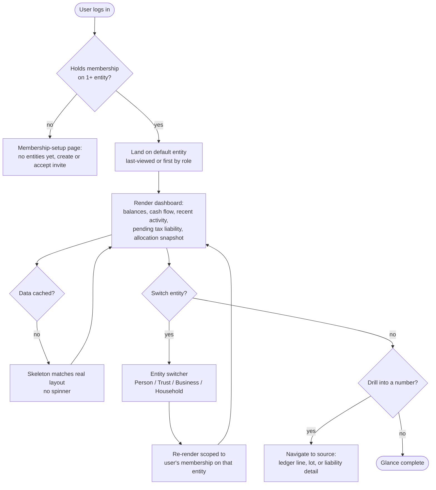

# Flow: Dashboard glance

**Story (PRD §4.1):** As the Principal, I want a dashboard of financial health per entity, so that I can tell at a glance how each entity is doing without opening separate spreadsheets or provider sites.

**Notes**
- Every number on this screen must be clickable through to its source (Overview principle: "every number earns trust").
- Filtered strictly by membership (owner/manager/viewer) — no transitive access via parent entity (PRD §5 permission model).
- Viewer-role household members see the household's shared accounts + their own entity, never another member's entity (PRD §4.8).
- **No-membership state (pass 6):** see `wireframes/membership-setup.html` — the Principal confirmed the dashboard's empty state can simply be the membership-setup page itself, not a separate illustrated empty-state screen.
- **"Skeleton matches real layout, no spinner" (pass 6, the Principal asked what this means):** while dashboard data is loading, the screen shows placeholder blocks already shaped like the real cards (same card chrome, same approximate text-line widths) instead of a spinner — so nothing visually jumps or re-flows once the real numbers arrive, they just fade in where the placeholders already were. A spinner tells the user "wait"; a layout-shaped skeleton also tells them "here's roughly what's coming." See Component inventory § Skeleton in design-system-spec.md.
