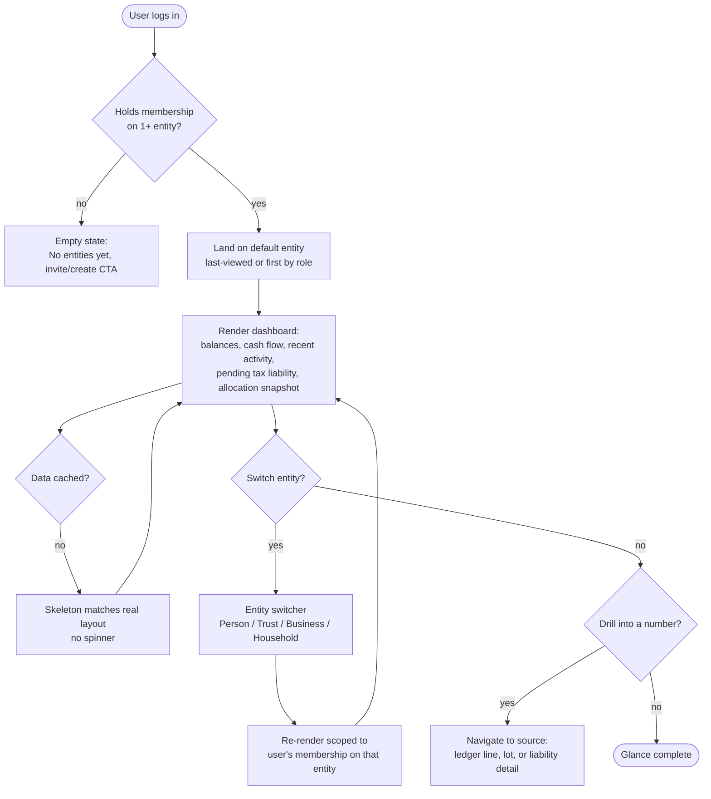

# Flow: Dashboard glance

**Story (PRD §4.1):** As the Principal, I want a dashboard of financial health per entity, so that I can tell at a glance how each entity is doing without opening separate spreadsheets or provider sites.

**Notes**
- Every number on this screen must be clickable through to its source (Overview principle: "every number earns trust").
- Filtered strictly by membership (owner/manager/viewer) — no transitive access via parent entity (PRD §5 permission model).
- Viewer-role household members see the household's shared accounts + their own entity, never another member's entity (PRD §4.8).
