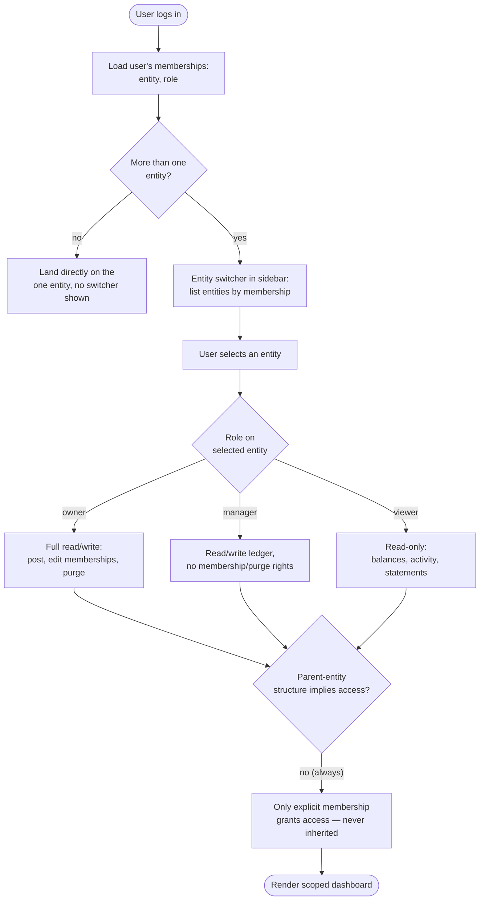

# Flow: Entity switch & membership access

**Story (PRD §4.8):** As a household member with a granted viewer role, I want to see the household's shared accounts and my own entity's finances, so that I have visibility into our joint financial picture without owning the underlying ledger.

**Notes**
- A Household's membership never transitively grants access to a member Person entity, or vice versa — every access is an explicit membership row (PRD §5, hard requirement).
- Role badges (`Owner`/`Manager`/`Viewer`) use decreasing visual weight — `default`/`secondary`/`outline` — matching the product-wide "variant weight encodes meaning" rule (design-system-spec.md § Financial semantics).
- A viewer never sees a write affordance rendered-then-disabled — the UI omits write controls entirely for a role that can't use them, rather than showing and graying them out (avoids a false promise of eventual access).
