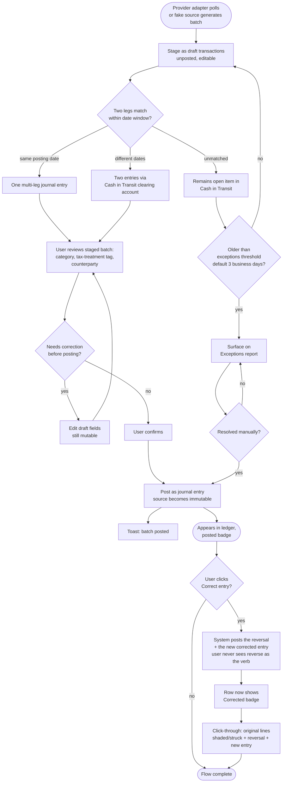

# Flow: Import & confirm transactions

**Story (PRD §4.2):** As the Principal, I want my bank and brokerage transactions imported automatically and staged as drafts, so that I can review and confirm them instead of hand-entering every transaction.

**Notes**
- **Reframed pass 6 (the Principal, review 4):** what the user is told is distinct from how it works underneath. Import is the immutable baseline and never changes after import; a draft is fully editable before posting (the "edit" the user actually wants happens here); after posting, the user-facing action is **"Correct entry"**, never "edit" and never "reverse" as a verb — even though the mechanism underneath is still a reversal-only pair (PRD §5, architecture unchanged). See design-system-spec.md § Correcting a posted entry.
- Draft rows carry the `Draft (staged)` badge (`--secondary`, clock icon); posted rows carry `Posted` (`--outline`, check icon); a corrected row carries `Corrected` (`--outline` + `--brand-2`-tinted dot, pencil icon) — see design-system-spec.md § Financial semantics.
- Click-through on a corrected row shows the full double-entry trail — original lines shaded/struck-through, the reversal, and the new corrected entry — so the correction stays fully auditable without the row itself ever using the word "reverse" as its primary affordance.
- Actor attribution (user / auto-post rule / system job) is shown on every draft and posted row, never inferred (PRD §5).
