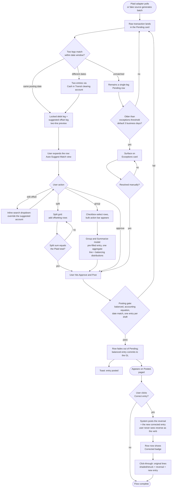

# Flow: Transactions — review, match & correct

**Story (PRD §4.2):** As the Principal, I want my bank and brokerage transactions imported automatically and staged for review, so that I can review and confirm them instead of hand-entering every transaction.

**Pass 7 (2026-10-02) — full rewrite.** The screen this flow describes is now **Transactions** (renamed from "Ledger"; "Import" is gone as a separate nav item — design-system-spec.md § Sidebar information architecture). The review mechanics below replace the old simple "stage → review → confirm" shape with the Principal's own Plaid bank-feed workflow spec (`temp/2026-10-02-sidebar-interview.md`): an expandable Pending inbox with a locked debit leg + suggested offset leg, a Split grid for one-to-many breakdowns, and a bulk Group & Summarize modal for many-to-one summaries. The post-posting "Correct entry" shape (pass 6) is unchanged and appended at the end.

**Notes**
- **The locked leg is always the custodial cash side** — it represents verified bank reality (the Plaid transaction itself) and is never editable, in the simple two-line preview, the Split grid, or the Group modal.
- **The suggested offset leg** is a pre-filled inline-search dropdown (historical rules + Plaid category), not a blank field — the user overrides it in place rather than building the line from scratch.
- **Split (one draft → one multi-leg entry):** a live validation loop disables submission until the split rows sum exactly to the raw transaction's absolute total.
- **Group (many drafts → one entry):** a floating bulk-action bar appears on any checkbox selection; "Group & Summarize" opens the same journal-entry modal used everywhere else (manual "+ New entry", Correct entry, Split), pre-filled with one aggregate primary line and the user's chosen balancing distributions. This is the one place a draft-to-entry relationship is many-to-one rather than one-to-one (ARCH §3 data-model delta).
- **Posting gate (team-lead ruling, 2026-10-02):** Σ debits = Σ credits; the accounting equation holds per entity; the entry date matches the bank date (or the Cash-in-Transit rule for mismatched dates); every posted draft links to exactly one entry. Any failure keeps the item in Pending — there is no partial or silent post.
- Draft rows carry the `Draft (staged)` badge (`--secondary`, clock icon); posted rows carry `Posted` (`--outline`, check icon); a corrected row carries `Corrected` (`--outline` + `--brand-2`-tinted dot, pencil icon) — see design-system-spec.md § Financial semantics.
- **Reframed pass 6 (the Principal, review 4), unchanged by this rewrite:** the user-facing action on a posted row is **"Correct entry,"** never "edit" and never "reverse" as a verb — the mechanism underneath is still a reversal-only pair (PRD §5). Click-through shows the full double-entry trail — original lines shaded/struck-through, the reversal, and the new corrected entry.
- **Auto-posted rows (addendum, pass 6), unchanged:** a row posted by a recurring rule shows the same `Posted` badge plus a `posted by rule — <name>` attribution line, and the identical Correct entry action — no separate edit affordance.
- Actor attribution (user / auto-post rule / system job) is shown on every draft and posted row, never inferred (PRD §5).
- Import stats/status (provider sync time, link-health) show as a banner at the top of this screen, not as a separate nav item — see design-system-spec.md § Sidebar information architecture.
