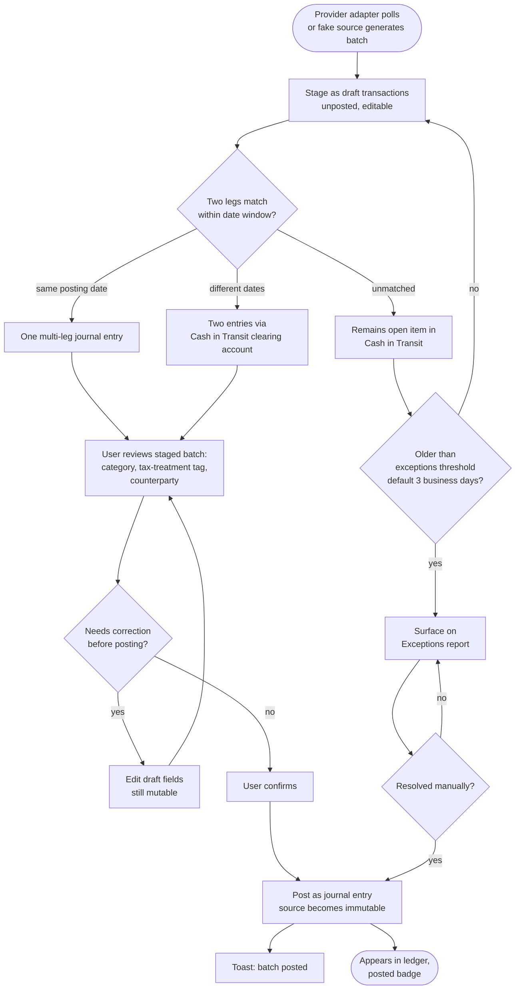

# Flow: Import & confirm transactions

**Story (PRD §4.2):** As the Principal, I want my bank and brokerage transactions imported automatically and staged as drafts, so that I can review and confirm them instead of hand-entering every transaction.

**Notes**
- Once posted, a transaction is immutable — the UI never offers an "edit" affordance on a posted row, only "reverse" (Overview principle: immutability is visible).
- Draft rows carry the `Draft (staged)` badge (`--secondary`, clock icon); posted rows carry `Posted` (`--outline`, check icon) — see design-system-spec.md § Financial semantics.
- Actor attribution (user / auto-post rule / system job) is shown on every draft and posted row, never inferred (PRD §5).
