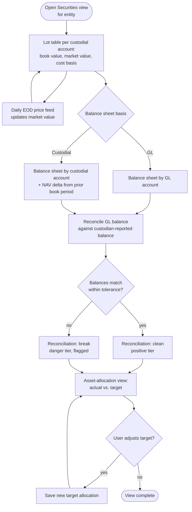

# Flow: Securities lots & balance sheet reconciliation

**Stories (PRD §4.5–4.7):** lot-based tracking with GL book value + daily market value; a balance sheet by GL account and a separate one by custodial account; an asset-allocation view against target.

**Notes**
- GL-vs-custodial is a `Tabs` toggle on one screen, not two separate pages — both read from the same lot data, different aggregation.
- A reconciliation break uses the danger tier (`--destructive`) and must surface on the dashboard glance too, not only here (cross-reference with Dashboard glance flow).
- Nominal vs. inflation-adjusted (CPI-U) is an orthogonal toggle available on any time-series chart on this screen, including the allocation-over-time view (PRD §4.9).
