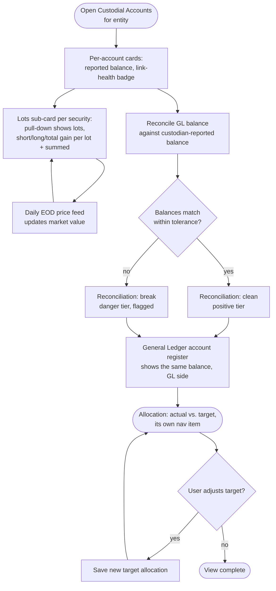

# Flow: Custodial reconciliation, lots & allocation

**Stories (PRD §4.5–4.7):** lot-based tracking with GL book value + daily market value; a balance sheet by GL account and a separate one by custodial account; an asset-allocation view against target.

**Pass 7 (2026-10-02):** redrawn for the sidebar IA rework (`temp/2026-10-02-sidebar-interview.md`) — "Securities" is gone as a nav item. Lots are now a sub-card on **Custodial Accounts**; the GL-vs-custodial view is two separate nav items (**General Ledger**, **Custodial Accounts**), not a `Tabs` toggle on one screen; **Allocation** is its own page. File kept at its original path for diff history; content fully rewritten.

**Notes**
- **No toggle (pass 7):** General Ledger and Custodial Accounts are two separate top-level nav items now — not one screen behind a `Tabs` switch. Both still read from the same lot/journal data; the split is presentation, not a data fork.
- Book-vs-market is implicit on Custodial Accounts' lots sub-card itself (the lot's own gain/loss figures), not a separate chart.
- A reconciliation break uses the danger tier (`--destructive`) and must surface on the Dashboard glance too, not only here (cross-reference with Dashboard glance flow).
- Nominal vs. inflation-adjusted (CPI-U) is an orthogonal toggle available on any time-series chart that has one, including Allocation's actual-vs-target-over-time view (PRD §4.9).
