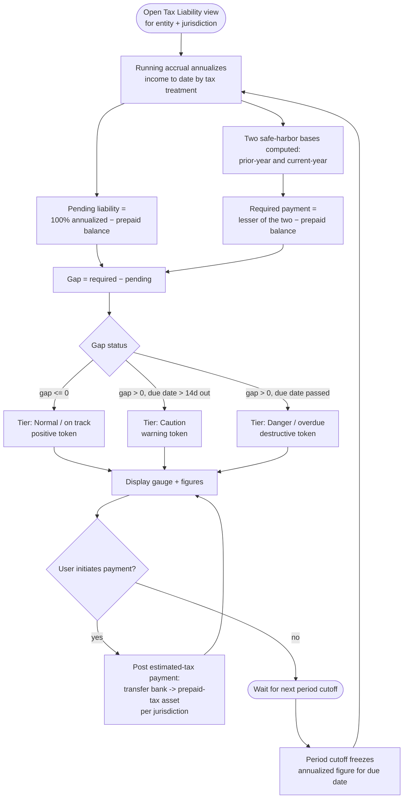

# Flow: Tax liability & safe-harbor

**Story (PRD §4.4):** As the Principal, I want a continuously updated view, per entity and jurisdiction, of my pending tax liability, the required safe-harbor payment, and the gap between them, so that I know exactly how much to wire by each due date.

**Notes**
- The three-tier status (normal/caution/danger) reuses the product-wide status vocabulary — see design-system-spec.md § Financial semantics — not a bespoke tax-page color.
- Jurisdiction due dates, multipliers, and cumulative percentages are data-driven (a lookup table), so this screen must render correctly for an arbitrary number of jurisdictions per entity, not just federal (PRD §5).
- At filing, frozen per-period figures export for Schedule AI / Form 2210 and the state equivalent — this flow's "freeze" step is the source of that export.
